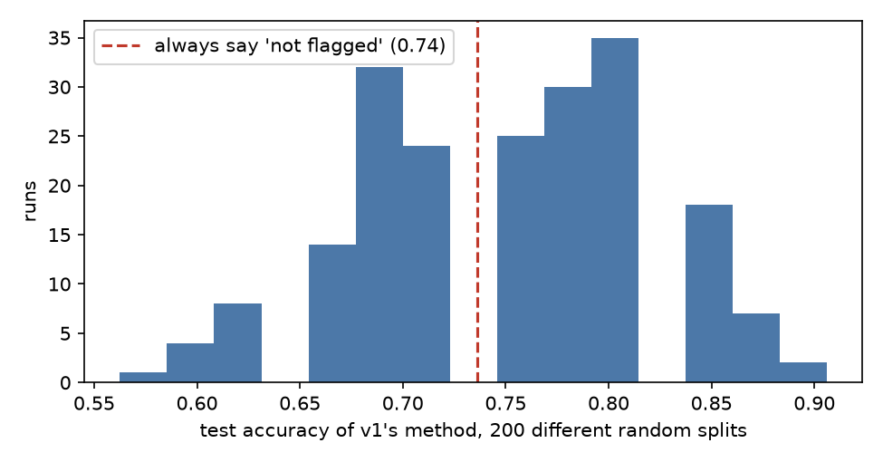
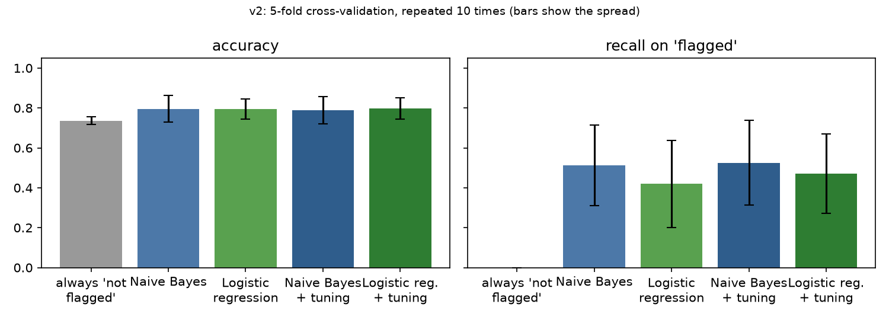

# Resume Selector with Naive Bayes

**Status:** v1 is a finished Coursera guided project (2025). **v2 re-evaluates it honestly** (October 2026). The sample is small (125 resumes), so read every number with its spread.

## Version history

| | v1: coursework | v2: honest evaluation |
|---|---|---|
| Code | the notebook, tag [`v1-coursework`](https://github.com/G-Eskayo/ML-Powered-Resume-Selector-using-Naive-Bayes/tree/v1-coursework) | `resume_selector.py`, `v2/run.py`, `tests/` |
| How it was scored | one random split, unseeded, vocabulary built from all resumes first | 5-fold cross-validation repeated 10 times, everything fitted inside each training fold |
| Headline | accuracy **1.00** (and 0.97 on a second split) | accuracy **0.80 ± 0.07** for the same Naive Bayes |
| Baseline (say "not flagged" every time) | not reported | **0.74** |
| Recall on the flagged class | 1.00 / 1.00 | **0.51 ± 0.20** |

**Why this exists:** a classifier that says it is perfect on 32 resumes is a claim to test, not a result to trust. The plan for how it was tested is in [`docs/v2-plan.md`](docs/v2-plan.md).

**The finding: v1's score was luck.** Re-running v1's exact method on 200 different random splits gives accuracy from 0.56 to 0.91, averaging **0.75**, about the same as the 0.74 you get by never flagging anyone:



## v2 results

Honest numbers, regenerated by `python v2/run.py` (full output in [`v2/results.json`](v2/results.json)). "Tuned" models choose their settings inside each training fold (nested cross-validation), so they are not tuned on their own test data.

| Model | Accuracy | Precision (flagged) | Recall (flagged) |
|---|---|---|---|
| Always "not flagged" | 0.74 ± 0.02 | n/a | 0.00 |
| Naive Bayes (v1's model) | 0.80 ± 0.07 | 0.67 ± 0.20 | 0.51 ± 0.20 |
| Logistic regression (TF-IDF) | 0.80 ± 0.05 | 0.68 ± 0.23 | 0.42 ± 0.22 |
| Naive Bayes, tuned | 0.79 ± 0.07 | 0.65 ± 0.20 | 0.53 ± 0.21 |
| Logistic regression, tuned | 0.80 ± 0.05 | 0.70 ± 0.18 | 0.47 ± 0.20 |



**What this says:** every real model lands near 0.80 against a 0.74 baseline, and tuning does not move it. The classifier finds roughly half of the flagged resumes. That is the honest ceiling of 125 resumes and bag-of-words features, not a failure of tuning.

**Why it misses.** Of the 25 resumes logistic regression gets wrong when they are held out, 18 are flagged resumes it called not flagged. Flagged resumes include data scientists, but also environmental scientists, public-health analysts and research scientists, whose vocabulary overlaps with the not-flagged chemists, lab technicians and other scientists. The words that push towards flagged are matlab, years, engineer, spss, sql, model, python, models; towards not flagged, laboratory, materials, equipment, lab, technician, managed, performed, samples. What the labels were meant to capture is not documented in this repository, which is itself a limit on what can be learned.

**What would actually improve it:** more labelled resumes and a written labelling rule, not a better algorithm.

### Run v2

```bash
python -m venv .venv && .venv/bin/pip install scikit-learn pandas numpy matplotlib pytest
.venv/bin/python -m pytest tests -q      # 8 tests
.venv/bin/python v2/run.py               # about 2 minutes; rewrites v2/results.json and the figures
```

## v1 (coursework)

This repository contains a Coursera course project implementing a **Naive Bayes classifier** for resume selection. The notebook demonstrates how to preprocess text data, train a classification model, and evaluate performance using Python’s `scikit-learn` library.

---

## 📘 Overview

The project titled **“Resume Selector with Naive Bayes”** focuses on applying text classification techniques to identify relevant resumes for specific job categories. The notebook follows a complete workflow — reading the dataset, transforming textual data, and building a probabilistic model using **Naive Bayes**.

---

## 🧠 Steps in the Notebook

1. **Import Libraries** – Uses `numpy`, `pandas`, and `scikit-learn`.
2. **Load Dataset** – Reads [`resume.csv`](resume.csv): 125 resumes, each labelled `flagged` or `not_flagged`.
3. **Text Preprocessing** – Converts raw text to lowercase and vectorizes it.
4. **Model Training** – Trains a `MultinomialNB` classifier.
5. **Model Evaluation** – Confusion matrix and classification report on a held-out test set.

---

## 🧰 Tools and Libraries

- Python 3  
- NumPy  
- Pandas  
- scikit-learn  
- Jupyter Notebook  

*(Only libraries confirmed in the provided notebook are listed.)*

---

## 📊 Results

From the notebook's own output (the test set is small, so one resume moves the numbers a lot):

| Split (train / test) | Test resumes | Accuracy | Flagged precision / recall |
|---|---|---|---|
| 75 / 25 | 32 | 1.00 | 1.00 / 1.00 |
| 70 / 30 | 38 | 0.97 | 0.86 / 1.00 |

Each run draws a fresh random split (no fixed seed), so your numbers will differ slightly.

---

## 🚀 How to Run

```bash
git clone https://github.com/G-Eskayo/ML-Powered-Resume-Selector-using-Naive-Bayes.git
cd ML-Powered-Resume-Selector-using-Naive-Bayes
pip install numpy pandas scikit-learn matplotlib seaborn wordcloud jupyter
jupyter notebook "Resume Selector with Naive Bayes.ipynb"
```

---

## 📂 Contents

```
Resume Selector with Naive Bayes.ipynb   v1: the coursework notebook
resume.csv                               the 125 labelled resumes (Latin-1 encoded)
resume_selector.py                       v2: leak-free pipelines, cross-validation, error analysis
tests/test_resume_selector.py            v2: 8 tests
v2/run.py                                v2: regenerates every number and figure
v2/results.json, v2/*.png                v2: the results
docs/v2-plan.md                          why v1's evidence was weak and what v2 sets out to do
```
